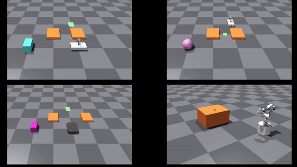

# Overview
This is an implementation of a Model Predictive Path Integral (MPPI) controller which uses IsaacGym as dynamical model for the rollouts. We provide several examples of what tasks you can solve with it: 

<p align="center">

</p>

You can extend the repository with your robots and tasks since it is designed to be modular and re-usable. 

# Installation

This project requires the source code of IsaacGym inside the folder
`thirdparties`. Download it from https://developer.nvidia.com/isaac-gym, extract it, and place
it in `mppi-isaac/thirdparty`. Then you can proceed with the installation descibed below.

## Virtual environment (advised)
You can install the necesary dependancies using [poetry](https://python-poetry.org/docs/) virtual environment. After installing poetry, move in `mppi-isaac` and run
```bash
poetry install --with dev
```
Bare in mind that the installation might take several minutes the first time. But it's worth it.

Access the virtual environment using
```bash
poetry shell
```
## System-level installation
Alternatively, you can also install at the system level using pip, eben though we advise using the virtual environment:
```bash
pip install .
```

## Test the installation
Test that everything is properly set-up, use pytest
```bash
cd examples
poetry run pytest
```

## Troubleshooting
If you have an Nvidia card and after running the simulation you get a black screen, you might need to force the use of the GPU card through ``export VK_ICD_FILENAMES=/usr/share/vulkan/icd.d/nvidia_icd.json``. Run this command from the same folder as the script to be launched

# Running the examples
Access the virtual environment if installed with poetry (with `poetry shell`). You can run two types of examples, either the ones using IsaacGym or the ones using pybullet. In the `examples` folder you find all the scripts. The ones realed to IsaacGym contains either "server" or "client" in the name. 

## IsaacGym examples
To run the examples with IsaacGym (for example for non-prehensile pushing and whole body control), you need two terminals because it is required to run a "server" and a "client" script. In the first one run the server:
```bash 
python3 heijn_push_server.py
```
In the second one the client:
```bash 
python3 heijn_push_client.py
```

## Pybullet examples
Simply run one of the example scripts which use pybullet, for instance for the panda robot:
```bash
python3 panda_robot_with_obstacles.py
```